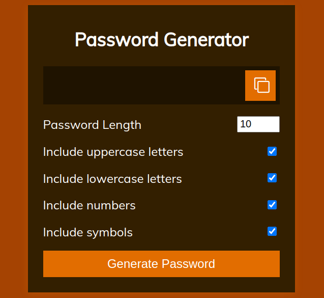

# password_generator
A simple HTML, CSS, JS web app to generate random password.

- ### `you can enter the length of the password`
- ### `After clicking on the Generate Password Button` 
- ### `You can copy the password by clicking on the copy to clipboard button.`

🔗 [password_generator](https://rohit8020.github.io/password_generator/)

# WEBAPP

